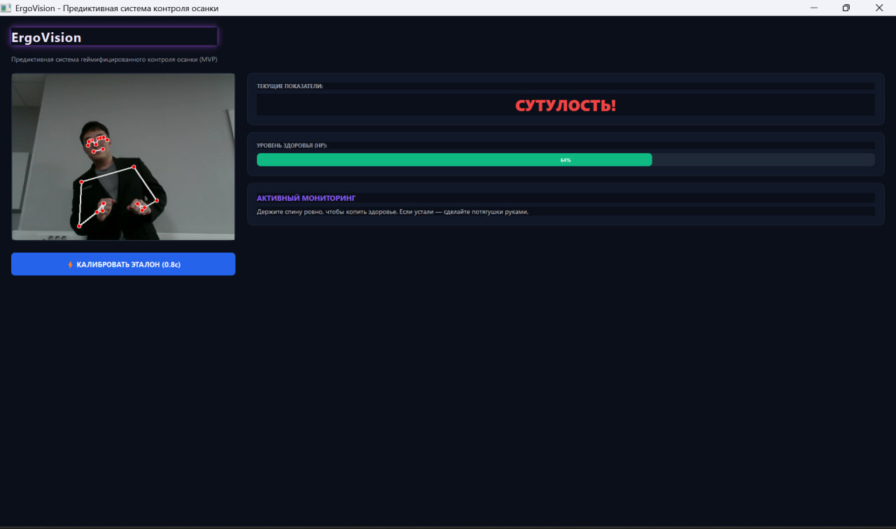

# ErgoVision 👁️🛡️ — Система предиктивного контроля осанки


**ErgoVision** — это интеллектуальный помощник, который превращает скучный контроль осанки в интерактивную игру. Используя алгоритмы компьютерного зрения, программа в реальном времени следит за положением твоего тела и помогает избежать проблем со спиной при длительной работе за компьютером.



## 🎯 Основная концепция (Геймификация)

Вместо раздражающих уведомлений проект использует игровую механику **Health Points (HP)**:
- **Здоровье (HP):** Уменьшается, когда вы сутулитесь или наклоняетесь слишком близко к монитору.
- **Квесты:** При критическом уровне HP активируется режим «Workout Quest» (Разминка). Чтобы восстановить очки здоровья, нужно выполнить физическое упражнение (например, потянуться), которое фиксируется камерой.

## 🚀 Технические возможности

1. **Захват движений (Pose Estimation):** Использование библиотеки **MediaPipe** для отслеживания 33 ключевых точек тела.
2. **Логика анализа (Engine):** - Вычисление отклонений по осям Y и Z относительно откалиброванной "идеальной" позиции.
   - Распознавание паттерна «Рука у лица» (детектирование попыток подпереть голову).
   - Определение критического наклона головы и сутулости (смещение линии плеч).
3. **Data Science модуль:** Система автоматически логирует все показатели в файл `posture_dataset.csv`. Это позволяет в будущем анализировать свои привычки и обучать более сложные ML-модели.
4. **Интерфейс (UI):** Стильное Dark-theme приложение на **PyQt5**, которое работает в режиме "Always on Top" (поверх всех окон).

## 📁 Структура проекта

* `main.py` — Точка входа в приложение.
* `engine.py` — «Мозг» системы: здесь происходит обработка видеопотока и расчет координат.
* `ui.py` — Описание графического интерфейса и логика визуализации (HP-бары, таймеры).
* `posture_dataset.csv` — Файл с данными для анализа твоей осанки.
* `image_16646a.jpg` — Скриншот интерфейса для документации.

## 🛠 Инструкция по установке

1. **Клонируйте репозиторий:**
   ```bash
   git clone [https://github.com/abbasarzybaev2007/ErgoVision.git](https://github.com/abbasarzybaev2007/ErgoVision.git)
   cd ErgoVision
2. **Установите библиотеки:**
   ```bash
   pip install opencv-python mediapipe PyQt5 numpy
3. **Запустите программу:**
   ```bash
   python main.py
  
## 💡 Как пользоваться

1. После запуска сядьте ровно и нажмите кнопку **«Калибровка»**. Система запомнит ваше положение как эталон.
2. Работайте в обычном режиме. Если вы начнете сутулиться, полоска HP станет красной и начнет уменьшаться.
3. Если появилось сообщение о квесте — просто откиньтесь назад или потянитесь, чтобы восстановить силы!

## 👤 Об авторе
**Аббас Арзыбаев** Студент 1-го курса образовательной программы «Прикладная математика» МИЭМ НИУ ВШЭ.  
Интересы: **Machine Learning**, **Data Science**, **Computer Vision**.

---
*Проект разработан с целью объединить математические алгоритмы и заботу о здоровье.*
